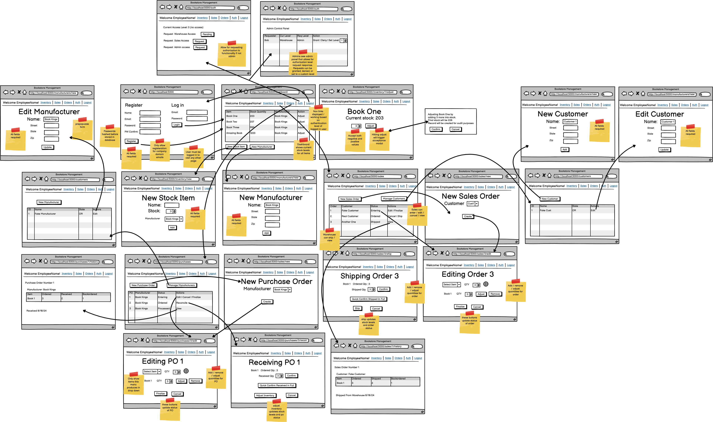
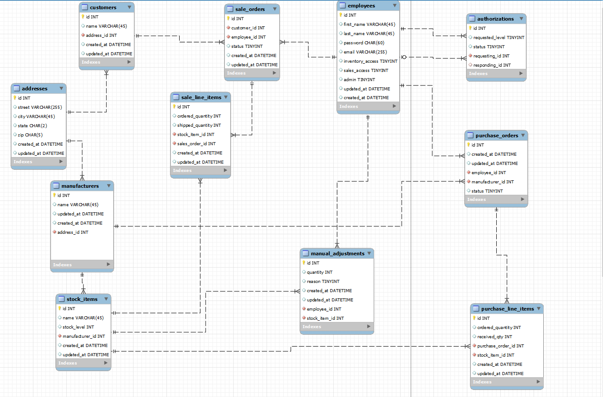

# Bookstore Inventory Management System

## Overview
The Bookstore Inventory Management System is a web application designed to streamline inventory control, order processing, and employee access management for a bookstore. The system features different access levels for employees, ensuring that only authorized personnel can perform specific tasks.

## Features
- **Inventory Control**: Manage stock levels, track incoming and outgoing orders, and adjust inventory as needed.
- **Order Processing**: Create and process purchase orders and sales orders efficiently.
- **Employee Access Levels**: Assign different access levels to employees based on their roles and responsibilities.
- 
# Wireframe and ERD

